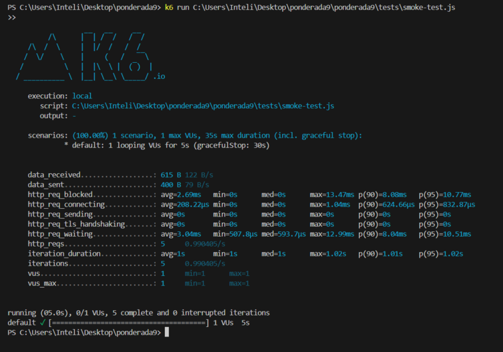

# Documentação dos Testes de Performance

### 1. Smoke Test





**Descrição:** O objetivo do smoke test é verificar se a aplicação está funcionando de maneira básica, sem erros críticos.

**Comando Executado:**
```bash
k6 run C:\Users\Inteli\Desktop\ponderada9\ponderada9\tests\smoke-test.js
```

**Resultados:**
- **Total de requisições:** 5
- **Dados recebidos:** 615 B
- **Dados enviados:** 400 B
- **Tempo médio de resposta:** 3.04 ms
- **Requisições falhadas:** 0

**Print da Execução:**


---

### 2. Load Test


**Descrição:** O load test visa verificar o comportamento da aplicação sob carga crescente.

**Comando Executado:**
```bash
k6 run C:\Users\Inteli\Desktop\ponderada9\ponderada9\tests\load-test.js
```

**Resultados:**
- **Total de requisições:** 4023
- **Dados recebidos:** 495 kB
- **Dados enviados:** 322 kB
- **Tempo médio de resposta:** 2.02 ms
- **Requisições falhadas:** 0

**Print da Execução:**


---

### 3. Stress Test


**Descrição:** O stress test avalia como a aplicação se comporta sob uma carga extrema.

**Comando Executado:**
```bash
k6 run C:\Users\Inteli\Desktop\ponderada9\ponderada9\tests\stress-test.js
```

**Resultados:**
- **Total de requisições:** 8041
- **Dados recebidos:** 989 kB
- **Dados enviados:** 643 kB
- **Tempo médio de resposta:** 2.3 ms
- **Requisições falhadas:** 0

**Print da Execução:**


---

### 4. Spike Test


**Descrição:** O spike test analisa como a aplicação responde a picos repentinos de carga.

**Comando Executado:**
```bash
k6 run C:\Users\Inteli\Desktop\ponderada9\ponderada9\tests\spike-test.js
```

**Resultados:**
- **Total de requisições:** 435130
- **Dados recebidos:** 54 MB
- **Dados enviados:** 35 MB
- **Tempo médio de resposta:** 44.49 ms
- **Requisições falhadas:** 0

**Print da Execução:**


---

### 5. Breakpoint Test


**Descrição:** O breakpoint test ajuda a identificar o limite da aplicação antes de falhas ocorrerem.

**Comando Executado:**
```bash
k6 run C:\Users\Inteli\Desktop\ponderada9\ponderada9\tests\break-test.js
```

**Resultados:**
- **Total de requisições:** 59950
- **Dados recebidos:** 7.4 MB
- **Dados enviados:** 4.8 MB
- **Tempo médio de resposta:** 4.75 ms
- **Requisições falhadas:** 0

**Print da Execução:**


---

### 6. Soak Test


**Descrição:** O soak test verifica a estabilidade da aplicação sob uma carga contínua por um período prolongado.

**Comando Executado:**
```bash
k6 run C:\Users\Inteli\Desktop\ponderada9\ponderada9\tests\soak-test.js
```

**Resultados:**
- **Total de requisições:** 11010
- **Dados recebidos:** 7.4 MB
- **Dados enviados:** 4.8 MB
- **Requisições falhadas:** 0

**Print da Execução:**


### Considerações Finais

Os testes realizados demonstraram que a aplicação mantém um bom desempenho em todas as situações testadas, com zero falhas em requisições. É importante monitorar continuamente o comportamento sob carga e realizar ajustes conforme necessário.
